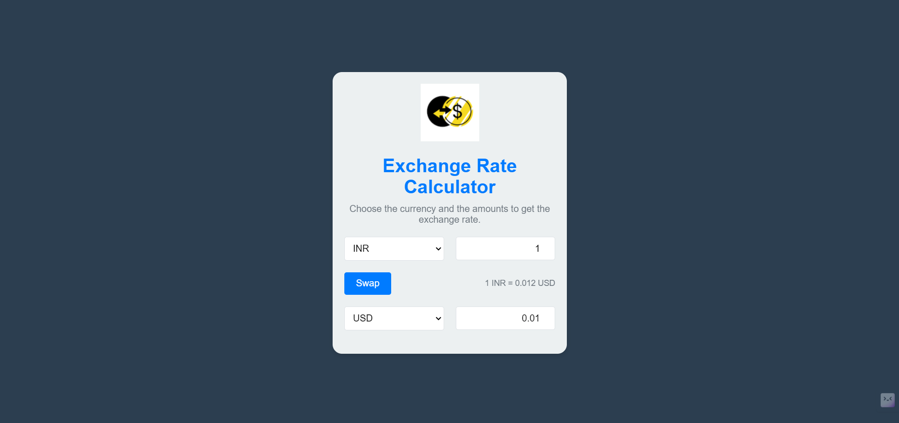
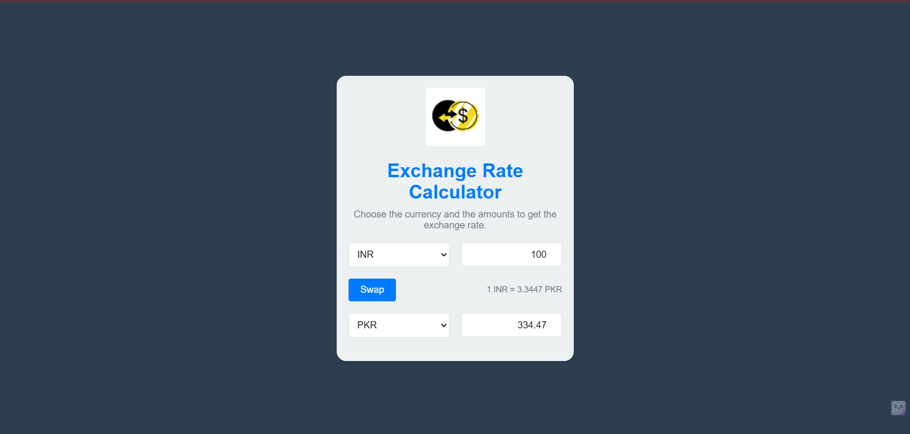

Sure, here's the updated README.md file in the specified format for your TO-DO application:

```markdown
# TO-DO APPLICATION

## Overview

This is a simple and intuitive to-do list application built using HTML, CSS, and JavaScript. The application allows users to create, manage, and save their tasks locally. It's designed to be user-friendly with a modern interface and smooth animations.

## Features

- Add new tasks
- Mark tasks as completed
- Delete tasks
- Save tasks locally to browser storage
- Responsive design

## Demo


*Inital View of the Application*


*After selecting and giving values*


*After swapping currencies*

## Installation

To run this application locally, follow these steps:

1. **Clone the repository:**
   ```bash
   git clone https://github.com/your-username/todo-application.git
   ```

2. **Navigate to the project directory:**
   ```bash
   cd todo-application
   ```

3. **Open `index.html` in your web browser:**
   You can simply double-click on the `index.html` file, or run a local server using Python:
   ```bash
   python -m http.server
   ```
   Then, open your browser and go to `http://localhost:8000`.

## Usage

1. **Add a Task:**
   - Enter the task description in the input field.
   - Click the "Add" button to add the task to the list.

2. **Mark a Task as Completed:**
   - Click the checkbox next to the task description.

3. **Delete a Task:**
   - Click the trash icon next to the task description to remove it from the list.

4. **Save Tasks Locally:**
   - Tasks are saved automatically to the local storage, ensuring your tasks persist even after closing the browser.

## File Structure

```
todo-application/
│
├── index.html          # The main HTML file
├── app.css             # The main CSS file
├── app.js              # The main JavaScript file
├── screenshots/        # Directory containing screenshot images
│   ├── screenshot1.png
│   └── screenshot2.png
└── README.md           # This README file
```

## Technologies Used

- HTML5
- CSS3
- JavaScript
- Bootstrap 4
- Font Awesome

## Contributing

Contributions are welcome! Please open an issue or submit a pull request for any bugs or improvements.


Developed by [Sai Viaksh](https://github.com/saiviaksh0710)
```
